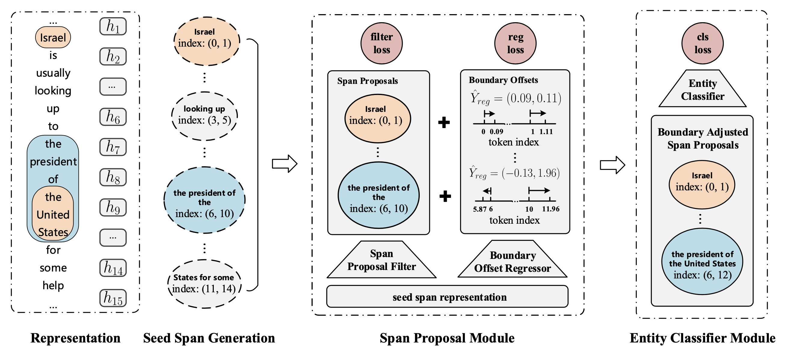

# README

Code for Two-stage Identifier: "**Locate and Label: A Two-stage Identifier for Nested Named Entity Recognition**", accepted at ACL 2021. For details of the model and experiments, please see [our paper](https://arxiv.org/abs/2105.06804).



## Setup

### Requirements

```bash
conda create --name acl python=3.8
conda activate acl
pip install -r requirements.txt
```
### Datasets

The datasets used in our experiments:

+ ACE04: https://catalog.ldc.upenn.edu/LDC2005T09
+ ACE05: https://catalog.ldc.upenn.edu/LDC2006T06
+ KBP17: https://catalog.ldc.upenn.edu/LDC2017D55
+ GENIA: http://www.geniaproject.org/genia-corpus

Data format:
```json
 {
       "tokens": ["2004-12-20T15:37:00", "Microscopic", "microcap", "Everlast", ",", "mainly", "a", "maker", "of", "boxing", "equipment", ",", "has", "soared", "over", "the", "last", "several", "days", "thanks", "to", "a", "licensing", "deal", "with", "Jacques", "Moret", "allowing", "Moret", "to", "buy", "out", "their", "women", "'s", "apparel", "license", "for", "$", "30", "million", ",", "on", "top", "of", "a", "$", "12.5", "million", "payment", "now", "."], 
       "pos": ["JJ", "JJ", "NN", "NNP", ",", "RB", "DT", "NN", "IN", "NN", "NN", ",", "VBZ", "VBN", "IN", "DT", "JJ", "JJ", "NNS", "NNS", "TO", "DT", "NN", "NN", "IN", "NNP", "NNP", "VBG", "NNP", "TO", "VB", "RP", "PRP$", "NNS", "POS", "NN", "NN", "IN", "$", "CD", "CD", ",", "IN", "NN", "IN", "DT", "$", "CD", "CD", "NN", "RB", "."], 
       "entities": [{"type": "ORG", "start": 1, "end": 4}, {"type": "ORG", "start": 5, "end": 11}, {"type": "ORG", "start": 25, "end": 27}, {"type": "ORG", "start": 28, "end": 29}, {"type": "ORG", "start": 32, "end": 33}, {"type": "PER", "start": 33, "end": 34}], 
       "ltokens": ["Everlast", "'s", "Rally", "Just", "Might", "Live", "up", "to", "the", "Name", "."], 
       "rtokens": ["In", "other", "words", ",", "a", "competitor", "has", "decided", "that", "one", "segment", "of", "the", "company", "'s", "business", "is", "potentially", "worth", "$", "42.5", "million", "."],
       "org_id": "MARKETVIEW_20041220.1537"
}
```

The `ltokens` contains the tokens from the previous sentence. And The `rtokens` contains the tokens from the next sentence.

Due to the license of LDC, we cannot directly release our preprocessed datasets of ACE04, ACE05 and KBP17. We only release the preprocessed GENIA dataset and the corresponding word vectors and dictionary. Download them from [here](https://drive.google.com/file/d/13Lf_pQ1-QNI94EHlvtcFhUcQeQeUDq8l/view?usp=sharing). 

If you need other datasets, please contact me (`syl@zju.edu.cn`) by email. Note that you need to state your identity and prove that you have obtained the LDC license.

### Pretrained Wordvecs

The word vectors used in our experiments:

+ BioWord2Vec for GENIA: https://github.com/cambridgeltl/BioNLP-2016
+ GloVe for other datasets: http://nlp.stanford.edu/data/glove.6B.zip

Download and extract the wordvecs from above links, save GloVe in `../glove` and BioWord2Vec in `../biovec`.

```bash
mkdir ../glove
mkdir ../biovec
mv glove.6B.100d.txt ../glove
mv PubMed-shuffle-win-30.txt ../biovec
```

Note: the BioWord2Vec needs to be converted from binary format to text format. The code is as follows:

```python
from gensim.models.keyedvectors import KeyedVectors
model = KeyedVectors.load_word2vec_format('PubMed-shuffle-win-30.bin', binary=True)
model.save_word2vec_format('./PubMed-shuffle-win-30.txt', binary=False)
```

## Example

### Train


```bash
python identifier.py train --config configs/example.conf
```

Note: You should edit this [line](https://github.com/tricktreat/locate-and-label/blob/3697adeaf36100f601366b233614699ae5ded965/config_reader.py#L17) in `config_reader.py` according to the actual number of GPUs. 

### Evaluation

You can download our [checkpoints](https://drive.google.com/drive/folders/1NaoL42N-g1t9jiif427HZ6B8MjbyGTaZ?usp=sharing), or train your own model and then evaluate the model.

```bash
cd data/
# download checkpoints from https://drive.google.com/drive/folders/1NaoL42N-g1t9jiif427HZ6B8MjbyGTaZ?usp=sharing
unzip checkpoints.zip
cd ../
python identifier.py eval --config configs/eval.conf
```

If you use the checkpoints we provided, you will get the following results:

+ ACE05:

```
-- Entities (named entity recognition (NER)) ---
An entity is considered correct if the entity type and span is predicted correctly

                type    precision       recall     f1-score      support
                 WEA        84.62        88.00        86.27           50
                 ORG        83.23        78.78        80.94          523
                 PER        88.02        92.05        89.99         1724
                 FAC        80.65        73.53        76.92          136
                 GPE        85.13        87.65        86.37          405
                 VEH        86.36        75.25        80.42          101
                 LOC        66.04        66.04        66.04           53

               micro        86.05        87.20        86.62         2992
               macro        82.01        80.19        81.00         2992
```

+ GENIA:

```
--- Entities (named entity recognition (NER)) ---
An entity is considered correct if the entity type and span is predicted correctly

                type    precision       recall     f1-score      support
                 RNA        89.91        89.91        89.91          109
                 DNA        76.79        79.16        77.96         1262
           cell_line        82.35        72.36        77.03          445
             protein        81.11        85.18        83.09         3084
           cell_type        72.90        75.91        74.37          606

               micro        79.46        81.84        80.63         5506
               macro        80.61        80.50        80.47         5506
```

+ ACE04:

```
--- Entities (named entity recognition (NER)) ---
An entity is considered correct if the entity type and span is predicted correctly

                type    precision       recall     f1-score      support
                 FAC        72.16        62.50        66.99          112
                 PER        91.62        91.26        91.44         1498
                 LOC        74.36        82.86        78.38          105
                 VEH        94.44       100.00        97.14           17
                 GPE        89.45        86.09        87.74          719
                 WEA        79.17        59.38        67.86           32
                 ORG        83.49        82.43        82.95          552

               micro        88.24        86.79        87.51         3035
               macro        83.53        80.64        81.78         3035
```


+ KBP17:

```
--- Entities (named entity recognition (NER)) ---
An entity is considered correct if the entity type and span is predicted correctly

                type    precision       recall     f1-score      support
                 LOC        66.75        64.41        65.56          399
                 FAC        72.62        64.06        68.08          679
                 PER        87.86        88.30        88.08         7083
                 ORG        80.06        72.29        75.98         2461
                 GPE        89.58        87.36        88.46         1978

               micro        85.31        82.96        84.12        12600
               macro        79.38        75.28        77.23        12600
```
### Quick Start

The preprocessed GENIA dataset is [available](https://drive.google.com/file/d/13Lf_pQ1-QNI94EHlvtcFhUcQeQeUDq8l/view?usp=sharing), so we use it as an example to demonstrate the training and evaluation of the model.

```bash
cd identifier

mkdir -p data/datasets
cd data/datasets
# download genia.zip (the preprocessed GENIA dataset, wordvec and vocabulary) from https://drive.google.com/file/d/13Lf_pQ1-QNI94EHlvtcFhUcQeQeUDq8l/view?usp=sharing.
unzip genia.zip
```
```bash
python identifier.py train --config configs/example.conf
```

output:
```
--- Entities (named entity recognition (NER)) ---
An entity is considered correct if the entity type and span is predicted correctly

                type    precision       recall     f1-score      support
             protein        81.19        85.08        83.09         3084
                 RNA        90.74        89.91        90.32          109
           cell_line        82.35        72.36        77.03          445
                 DNA        76.83        79.08        77.94         1262
           cell_type        72.90        75.91        74.37          606

               micro        79.53        81.77        80.63         5506
               macro        80.80        80.47        80.55         5506

Best F1 score: 80.63560463237275, achieved at Epoch: 34
2021-01-02 15:07:39,565 [MainThread  ] [INFO ]  Logged in: data/genia/main/genia_train/2021-01-02_05:32:27.317850
2021-01-02 15:07:39,565 [MainThread  ] [INFO ]  Saved in: data/genia/main/genia_train/2021-01-02_05:32:27.317850
```

```bash
vim configs/eval.conf
# change model_path to the path of the trained model.
# eg: model_path = data/genia/main/genia_train/2021-01-02_05:32:27.317850/final_model
python identifier.py eval --config configs/eval.conf
```

output:
```
--------------------------------------------------
Config:
data/checkpoint/genia_train/2021-01-02_05:32:27.317850/final_model
Namespace(bert_before_lstm=True, cache_path=None, char_lstm_drop=0.2, char_lstm_layers=1, char_size=50, config='configs/eval.conf', cpu=False, dataset_path='data/datasets/genia/genia_test_context.json', debug=False, device_id='0', eval_batch_size=4, example_count=None, freeze_transformer=False, label='2021-01-02_eval', log_path='data/genia/main/', lowercase=False, lstm_drop=0.2, lstm_layers=1, model_path='data/checkpoint/genia_train/2021-01-02_05:32:27.317850/final_model', model_type='identifier', neg_entity_count=5, nms=0.65, no_filter='sigmoid', no_overlapping=False, no_regressor=False, no_times_count=False, norm='sigmoid', pool_type='max', pos_size=25, prop_drop=0.5, reduce_dim=True, sampling_processes=4, seed=47, size_embedding=25, spn_filter=5, store_examples=True, store_predictions=True, tokenizer_path='data/checkpoint/genia_train/2021-01-02_05:32:27.317850/final_model', types_path='data/datasets/genia/genia_types.json', use_char_lstm=True, use_entity_ctx=True, use_glove=True, use_pos=True, use_size_embedding=False, weight_decay=0.01, window_size=[0, 1, 2, 3, 4, 5, 6, 7, 8, 9, 10], wordvec_path='../biovec/PubMed-shuffle-win-30.txt')
Repeat 1 times
--------------------------------------------------
Iteration 0
--------------------------------------------------
Avaliable devices:  [3]
Using Random Seed 47
2021-05-22 17:52:44,101 [MainThread  ] [INFO ]  Dataset: data/datasets/genia/genia_test_context.json
2021-05-22 17:52:44,101 [MainThread  ] [INFO ]  Model: identifier
Reused vocab!
Parse dataset 'test': 100%|███████████████████████████████████████| 1854/1854 [00:09<00:00, 202.86it/s]
2021-05-22 17:52:53,507 [MainThread  ] [INFO ]  Relation type count: 1
2021-05-22 17:52:53,507 [MainThread  ] [INFO ]  Entity type count: 6
2021-05-22 17:52:53,507 [MainThread  ] [INFO ]  Entities:
2021-05-22 17:52:53,507 [MainThread  ] [INFO ]  No Entity=0
2021-05-22 17:52:53,508 [MainThread  ] [INFO ]  DNA=1
2021-05-22 17:52:53,508 [MainThread  ] [INFO ]  RNA=2
2021-05-22 17:52:53,508 [MainThread  ] [INFO ]  cell_type=3
2021-05-22 17:52:53,508 [MainThread  ] [INFO ]  protein=4
2021-05-22 17:52:53,508 [MainThread  ] [INFO ]  cell_line=5
2021-05-22 17:52:53,508 [MainThread  ] [INFO ]  Relations:
2021-05-22 17:52:53,508 [MainThread  ] [INFO ]  No Relation=0
2021-05-22 17:52:53,508 [MainThread  ] [INFO ]  Dataset: test
2021-05-22 17:52:53,508 [MainThread  ] [INFO ]  Document count: 1854
2021-05-22 17:52:53,508 [MainThread  ] [INFO ]  Relation count: 0
2021-05-22 17:52:53,508 [MainThread  ] [INFO ]  Entity count: 5506
2021-05-22 17:52:53,508 [MainThread  ] [INFO ]  Context size: 242
2021-05-22 17:53:10,348 [MainThread  ] [INFO ]  Evaluate: test
Evaluate epoch 0: 100%|██████████████████████████████████████████| 464/464 [01:14<00:00,  6.26it/s]
Enmuberated Spans: 0
Evaluation

--- Entities (named entity recognition (NER)) ---
An entity is considered correct if the entity type and span is predicted correctly

                type    precision       recall     f1-score      support
           cell_line        82.60        71.46        76.63          445
                 DNA        77.67        78.29        77.98         1262
                 RNA        92.45        89.91        91.16          109
           cell_type        73.79        75.25        74.51          606
             protein        81.99        84.57        83.26         3084

               micro        80.33        81.15        80.74         5506
               macro        81.70        79.89        80.71         5506
2021-05-22 17:54:28,943 [MainThread  ] [INFO ]  Logged in: data/genia/main/genia_eval/2021-05-22_17:52:43.991876
```

## Citation
If you have any questions related to the code or the paper, feel free to email `syl@zju.edu.cn`.

```bibtex
@inproceedings{shen2021locateandlabel,
    author = {Shen, Yongliang and Ma, Xinyin and Tan, Zeqi and Zhang, Shuai and Wang, Wen and Lu, Weiming},
    title = {Locate and Label: A Two-stage Identifier for Nested Named Entity Recognition},
    url = {https://arxiv.org/abs/2105.06804},
    booktitle = "Proceedings of the 59th Annual Meeting of the Association for Computational Linguistics",
    year = {2021},
}
```